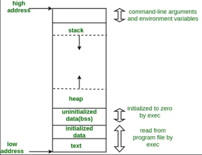
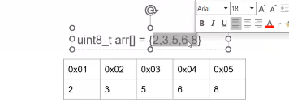
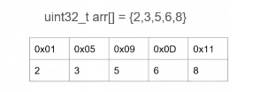

# Memory layout
Chương trình .exe/ .hex nạp vào máy tính hay vi điều khiển được lưu ở bộ nhớ SSD(ROM) và FLASH. Khi chạy chương trình trên window thì chương trình này sẽ được copy vào bộ nhớ RAM để thực thi.
 Chương trình C/C++ được tổ chức lưu trong memory layout (phân vùng nhớ).
## Khái niệm
Bộ nhớ của chương trình thường được phân chia thành các phân vùng khác nhau, mỗi phân vùng có mục đích và quy tắc sử dụng riêng, bao gồm các phần vùng nhớ sau:
- Text segment
- Data segment
- BSS segment
- Heap 
- Stack 
 
### Phân vùng nhớ Text:
- Chứa mã máy, quyền truy cập chỉ là đọc và thực thi, không có quyền ghi, điều này ngăn chặn chương trình việc tự sửa đổi mã máy của nó.
### Data segment 
- Data segment là một phần trong bộ nhớ của chương trình, nơi lưu trữ các biến toàn cục và các biến static được khai báo trong mã nguồn.
- Read only Data chứa biến const toàn cục, biên static const và nội dung của chuỗi hằng. Quyền truy cập là đọc, không có quyền ghi.
#### Initialized Data Segment(Dữ liệu đã khởi tạo) : Chứa giá trị của các biến toàn cục và biến tĩnh (static global và static local) được khởi tạo với giá trị khác 0.
- Quyền truy cập là đọc và ghi. 
- Tất cả dữ liệu sẽ được thu hồi sau khi chương trình kết thúc.
**Ví dụ 1**
```c
#include<stdio.h>

const int a = 10; 
char *arr1 = "Hello";
int main()
{
    // a = 20;                  // ở đây sẽ báo lỗi vì a là hằng số và không được phép thay đổi 
    // arr[1]='a';
    printf("%d", a);
    printf("%s", arr1);

}
```
**Ví dụ 2**
```c
#include <stdio.h>

int a = 10;			        // Biến toàn cục khởi tạo khác 0
double d = 20.5;		    // Biến toàn cục khởi tạo khác 0
static int var = 5;		    // Biến static toàn cục khởi tạo khác 0

void test()
{
    static int local = 10;	// Biến static cục bộ khởi tạo khác 0
}

int main()
{  
    a = 15;			// Có thể đọc và thay đổi giá trị của biến
    d = 25.7;
    var = 12;

    printf("a: %d\n", a);
    printf("d: %f\n", d);
    printf("var: %d\n", var);
    
    return 0;
}
```
#### Unitialize Data Segment (Dữ liệu chưa khởi tạo) BSS Segment:
- Chứa giá trị mặc định của các biến toàn cục và biến tĩnh. 
- Dữ liệu trong phân vùng thường được giá trị 0.
- Quyền truy cập : Data segment thường có quyền đọc và ghi, nghĩa là dữ liệu có thể đọc và sửa đổi trong quá trình thực thi của chương trình.
**Ví dụ 1**
```c
int var ; 
static int static_var;
```
**Ví dụ 2**
```c
#include <stdio.h>

typedef struct 			// Đây là kiểu dữ liệu,
{				        // Không nằm bất kì trong phân vùng nào!	
    int x;
    int y;
} Point_Data;

int a = 0;			// Biến toàn cục khởi tạo bằng 0
int b;				// Biến toàn cục ko khởi tạo

static int global = 0;		// Biến static toàn cục khởi tạo bằng 0
static int global_2;		// Biến static toàn cục ko khởi tạo

static Point_Data p1 = {5,7};	// Biến p1 này đã khởi tạo có giá trị nên nằm ở DS

void test(){
    static int local = 0;	// Biến static cục bộ khởi tạo bằng 0
    static int local_2;		// Biến static cục bộ ko khởi tạo
}

int main() {
    global = 0;			// Dù thay đổi giá trị nó vẫn nằm ở BSS

    printf("a: %d\n", a);
    printf("global: %d\n", global);

    return 0;
}
```
### Heap
 - Heap được sử dụng để cấp phát động trong quá trình thực thi của chương trình
- Điều này cho phép chương trình tạo ta và giải phóng bộ nhớ theo như cầu, thích ứng với sự biến đổi của dữ liệu trong quá trình chạy.
Khi khai báo một cái mảng 

mảng này sẽ cấp phát các địa chỉ liền kề vì ở đây là uint8_t sẽ là cách nhau một byte(8bit)

còn nếu khai báo với biến uint16_t thì sẽ được cấp phát địa chỉ cách nhau 2 byte như trên 

tương tự với kiểu uint32_t thì sẽ cách nhau 4 byte.
Vì vậy nên sử dụng cấp phát động để tối ưu bộ nhớ và thư viện Stlib sẽ có các hàm malloc , calloc, realloc và free.

**Hàm malloc()**
Cấp phát một vùng nhớ có kích thước được xác định bằng số byte và trả về một con trỏ trỏ tới vùng nhớ này.
**Cú pháp**
```c
int *arr = (int*)malloc(5 * sizeof(int)); // Cấp phát mảng 5 phần tử kiểu int tính ra là 20 byte
```
**Ví dụ**
```c

#include <stdio.h>
#include <stdlib.h>
#include <stdint.h>

int main ( int argc, char const *argv[]){
    uint16_t *ptr= NULL;
    ptr = (uint16_t*)malloc (sizeof(uint16_t)*4);

    for (int i=0; i<4; i++){
        ptr[i]=2*i;
    }
    for (int i=0; i<8; i++){
        printf("dia chi: %p, gia tri: %d\n", (uint8_t*)ptr+i, *((uint8_t*)ptr+i));
        // printf("dia chi: %p, gia tri: %d\n", ptr+i, *ptr+i);
    }
    free (ptr);
}
```
**Kết quả**
```c
dia chi: 0000000000C66BF0, gia tri: 0
dia chi: 0000000000C66BF1, gia tri: 0
dia chi: 0000000000C66BF2, gia tri: 2
dia chi: 0000000000C66BF3, gia tri: 0
dia chi: 0000000000C66BF4, gia tri: 4
dia chi: 0000000000C66BF5, gia tri: 0
dia chi: 0000000000C66BF6, gia tri: 6
dia chi: 0000000000C66BF7, gia tri: 0
```
Giải thích tại sao lại có kết quả như vậy, lấy phần tử ptr[1] đại diện:
- ptr[1]=2 (dang nhị phân 0b 00000000 00000010)
- byte 3 :0b00000010
- byte 4 :0b00000000

**Hàm calloc()**
Cấp phát bộ nhớ cho một mangr gồm nhiều phần tử, đồng thời khởi tạo tất cả các phần tử về giá trị 0
```c
void *calloc(sizre_t num, size_t size);
```
**Ví dụ**
```c
#include <stdio.h>
#include <stdlib.h>
#include <stdint.h>

int main() {
    // Cấp phát bộ nhớ cho 6 phần tử kiểu uint16_t bằng hàm calloc
    uint16_t *ptr = NULL;
    ptr = (uint16_t*)calloc(6, sizeof(uint16_t));

    // In địa chỉ và giá trị của từng phần tử trong mảng
    for (int i = 0; i < 6; i++) {
        // printf("Dia Chi: %p, gia tri: %d\n", (void*)(ptr + i), ptr[i]);
         printf("dia chi: %p, gia tri: %d\n", (uint16_t*)ptr+i, *((uint16_t*)ptr+i));
    }
    // Giải phóng bộ nhớ đã cấp phát
    free(ptr);

    return 0;
}

```
```c
dia chi: 0000000000B86BF0, gia tri: 0
dia chi: 0000000000B86BF2, gia tri: 0
dia chi: 0000000000B86BF4, gia tri: 0
dia chi: 0000000000B86BF6, gia tri: 0
dia chi: 0000000000B86BF8, gia tri: 0
dia chi: 0000000000B86BFA, gia tri: 0
```
**Hàm realloc()**
Thay đỏi  kích thước của vùng nhớ đã cấp phát trước đó (do malloc và realloc) và trả về một con trỏ trỏ đến vunghf nhớ mới (địa chỉ có thể thay đổi)
```c
void *realloc(void *ptr, size_t size); 
```
- ptr: con trỏ đến vùng nhớ đã được cấp phát trước đó
- size: kich thước mới của bộ nhớ(tinh bằng byte)
**Ví dụ**
```c
uint16_t *ptr = NULL;
// Cấp phát bộ nhớ cho 4 phần tử uint16_t (tổng cộng 8 byte)
ptr = (uint16_t*)malloc(sizeof(uint16_t)*4);

// Cấp phát thêm bộ nhớ cho 6 phần tử uint16_t (tổng cộng 12 byte)
ptr = (uint16_t*)realloc(ptr, sizeof(uint16_t)*6);
```

```c
#include <stdio.h>
#include <stdlib.h>

int main() {
    int *arr;      // Con trỏ mảng động
    int initialSize = 5; // Kích thước ban đầu của mảng
    int newSize = 10;    // Kích thước mới của mảng
    int i;

    // Cấp phát mảng động ban đầu bằng malloc
    arr = (int*)malloc(initialSize * sizeof(int));
    if (arr == NULL) {
        printf("Không đủ bộ nhớ để cấp phát!\n");
        return 1;
    }

    // Khởi tạo giá trị cho mảng ban đầu
    for (i = 0; i < initialSize; i++) {
        arr[i] = i + 1; // Gán giá trị 1, 2, 3, 4, 5
    }

    // In các phần tử ban đầu
    printf("Mang ban dau:\n");
    for (i = 0; i < initialSize; i++) {
        printf("%d ", arr[i]);
    }
    printf("\n");

    // Thay đổi kích thước mảng bằng realloc
    arr = (int*)realloc(arr, newSize * sizeof(int));
    if (arr == NULL) {
        printf("Không thể thay đổi kích thước mảng!\n");
        return 1;
    }

    // Khởi tạo các phần tử mới của mảng
    for (i = initialSize; i < newSize; i++) {
        arr[i] = (i + 1) * 10; // Gán giá trị 60, 70, 80, 90, 100
    }

    // In các phần tử sau khi thay đổi kích thước
    printf("Mang sau khi thay doi kich thuoc:\n");
    for (i = 0; i < newSize; i++) {
        printf("%d ", arr[i]);
    }
    printf("\n");

    // Giải phóng bộ nhớ
    free(arr);

    return 0;
}

```
Phần bộ nhớ mới được cấp phát **thêm** không được khởi tạo và có thể chứa giá trị rác.
**Hàm free**
Giải phóng bộ nhớ đã được cấp phát trước đó bằng ```malloc```, ```calloc```, hoặc ```realloc```.
### Stack
Stack chứa các biến cục bộ, tham số truyền vào
Quyền truy cập : đọc và ghi, nghĩa là có thể độc và thay đổi giá trị của biến trong suốt thời gian chương trình chạy
- Sau khi ra khỏi hàm, sẽ thu hồi vùng nhớ
- Hoạt động theo LIFO (Last in first out)
- 
##### Câu hỏi  

**Câu 1:** Tại sao biến const khi khai báo cục bộ thì lại thay đổi được tuy nhiên biến const khi khai báo toàn cục thì lại không thay đổi được giá trị ?

Những biến khai báo ở hàm thì nó sẽ được lưu vào phân vùng stack chứ nó không nằm trong phân vùng text nên nó có thể thay đổi được giá trị.

Hằng số const ở phạm vi toàn cục, trình biên dịch sẽ lưu nó phân vùng bộ nhớ Read Only Data đây là vùng chỉ độc . Khi cố gắng thay đổi giá trị của global_const thông qua con trỏ, hệ điều hành sẽ phát hiện và gây gỗi Segmentation Fault do vi phạm quyền truy cập bộ nhớ. 

**Câu 2:** Sự khác nhau của Malloc, calloc,realloc ?
