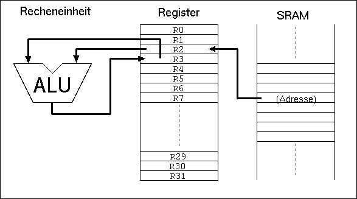

**Extern - Static- Volatile**
## 1.1. Extern 
### 1.1.1. Khái niệm về Extrern
- Từ khóa ```Extern``` được sử dụng để thông báo rằng biến hoặc hàm đã được khai báo ở file khác và có thể được sử dụng trong file hiện tại.
**Ví dụ**
File main.c
```c
#include<stdio.h>
 
 extern int count;
 extern void display();
int main(int argc, char const *argv[])
{
    display();
    count = 20;
    printf("count = %d\n",count);
    display();
    return 0;
}
```
 File test.c
 ```c
 
#include <stdio.h>

int count =10;
void display()
{
    printf("test.c:%d\n",count);
}
 ```
 Kết quả chương trình sau khi thực hiện makefile:
```c
test.c:10
count = 20
test.c:20
```
### 1.1.2. **Ứng dụng của extern**
- Chia sẽ biến và hàm giữa các file nguồn:
- Cho phép chia sẻ biến và hàm giữa nhiều file nguồn trong một chương trình 
- Extern có thể được sử dụng kết nối các module hoặc thư viên trong một dự án lớn 
# 2. Static
## 2.1 Static global variables
- Biến toàn cục tĩnh là các biến được khai báo với từ khóa ```static``` ở ngoài tất cả các hàm nó hạn chế phạm vi của biến đó chỉ trong file nguồn hiện tại.
- **Phạm vi truy cập chỉ giới hạn trong file**:Chỉ có thể truy cập được trong file nó được khai báo, không thế được sử dụng bởi các file khác, ngay cả khi nó được khai báo với từ khóa ```extern```
- **Ví dụ**

File main.c 
```c
#include <stdio.h>

extern void display();
//extern int s_g_value;
extern int g_value;

int main()
{
	printf("hello\n");
	g_value = 40;
	
	display();

	return 0;
}

```
File test.c 
```c
#include <stdio.h>

int g_value = 30;
static int s_g_value = 20;


void display()
{
	printf("static global value: %d\n", s_g_value);
	printf("global value: %d\n", g_value);
}
```

## 2.1 Static local variables
- Biến cục bộ tĩnh là các biến cục bộ được khai báo với từ khóa ```static``` ở trong phạm vi của hàm.
 ```c
 #include<stdio.h>

void exampleFunction()
{
    static int count = 0; // nếu mà  int count thì sẽ in ra màn hình 3 cái count=1 
    count++;
    printf("count = %d\n",count);
}
int main()
{
    exampleFunction(); // In ra count =1
    exampleFunction(); // In ra count =2
    exampleFunction(); // In ra count =3
    return 0;
}
 ```
 **Kết quả**
 ```c
 count = 1
count = 2
count = 3
 ```
 **Ví dụ không có static local**
 ```c
 #include<stdio.h>

void exampleFunction()
{
    int count = 0; // nếu mà  int count thì sẽ in ra màn hình 3 cái count=1 
    count++;
    printf("count = %d\n",count);
}
int main()
{
    exampleFunction();
    exampleFunction();
    exampleFunction();
    return 0;
} 
 ```
**Kết quả**
```c
count = 1
count = 1
count = 1
```
**Ứng dụng**
- Lưu trữ trạng thái giữa các lần gọi hàm. Sử dụng biến static để theo dỗi trạng thái giữa các lần gọi hàm mà không cần sử dụng biến toàn cục.
# 3. Volatile
- Từ khóa ```volatile``` được sử dụng để thông báo cho trình biên dịch rằng giá trị của một biến có thể thay đổi bất kỳ lúc nào, trình biên dịch không được tối ưu hóa nó. Nó ngăn trình chặn trình biên dịch tối ưu hóa bỏ các thao tác trên biên đó, giữ cho các thao tác được thực hiện đúng như định nghĩa.
- Nếu không sử dụng ```volatile```, trình biên dịch có thể tối ưu bằng cách lưu giá trị của biến vào thanh ghi và bỏ qua việc đọc lại từ bộ nhớ, dẫn tới hành vi không mong muốn.

Các trường hợp sử dụng biến volatile trong nhúng: 
 - Memory-mapped peripheral registers (thanh ghi ngoại vi có ánh xạ đến ô nhớ)
 - Biến toàn cục được truy xuất từ các tiến trình con xử lý ngắt (interrupt service routine)
 - Biến toàn cụ được truy xuất từ nhiểu tác vụ trong một ứng dụng đa lường 

# 4. Register
 Từ khóa ```register``` được sử dụnng để yêu cầu trình biên dịch lưu trữ một biến trong các thanh ghi chứ không phải bộ nhớ RAM.
 Tuy nhiên, lưu ý rằng việc sử dụng ```register``` chỉ là một đề xuất cho trình biên dịch và không đảm bảo rằng biến sẽ được lưu trữ trong thanh ghi mà thực tế trình biên dịch có thể quyết định không tuân thủ lời đề xuất này.
 
 
 